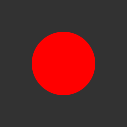
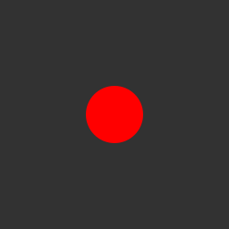
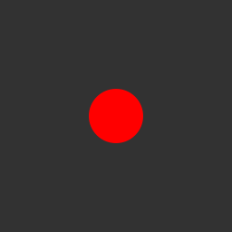
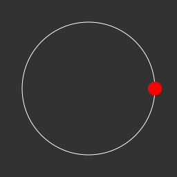
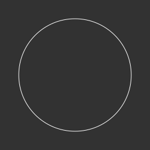

# Examples
---

## Minimal PNG/SVG

The following example shows how to create a frame with a gray background and draw a red circle at the center of it's canvas. Global variables `WIDTH` and `HEIGHT` are used provided by the CLI options are integers in pixels. Also `OUTPUT_FILE` is used when exporting also provided in the CLI options this is not required to use, passing a string like "my_image" will work as well.
```lua
-- main.lua

new_frame()
background(gray(50))

no_stroke()
fill(rgb(255, 0, 0))
circle(WIDTH / 2, HEIGHT / 2, 64)

export_png(OUTPUT_FILE)
-- or for exporting as a SVG use
-- export_svg(OUTPUT_FILE)
```


---

## Minimal GIF

The following example is similar to the previous example but instead of a static circle at the center of the canvas it will move to the right for 20 frames and then loop. similar to exporting a PNG/SVG `OUPUT_FILE` is used as the file name and `100` is the duration of each frame in the GIF as it's the default if a value isnt provided.
```lua
-- main.lua

local cx = WIDTH / 2
local cy = HEIGHT / 2

for i=0,20 do
    new_frame()
    background(gray(50))

    no_stroke()
    fill(rgb(255, 0, 0))
    circle(cx, cy, 32)

    cx = cx + 16
end

export_gif(OUTPUT_FILE)
```


---

## CLI Data Options

For this example lets say you have the command `./imagine --data radius=30`. Internally the value given which in this case is a `integer` will be `20` and can be accesed through the global variable `D_RADIUS`. This allows for generation to be more dynamic and removes the need to edit code to make small changes. You can provide as many data options as you would like by just adding a new data option for example `./imagine --data radius=20 --data value=false`.

```lua
-- main.lua

local cx = WIDTH / 2
local cy = HEIGHT / 2

for i=0,20 do
    new_frame()
    background(gray(50))

    no_stroke()
    fill(rgb(255, 0, 0))
    circle(cx, cy, D_RADIUS)

    cx = cx + 16
end

export_gif(OUTPUT_FILE)
```


---

## Advance GIF Examples

I am going to show you two code examples that are going to be the same with a very slight change. With `orbit_a.lua` shows you how to create GIF with a circle orbiting a center point and each frame is a new canvas to be drawn on. While `orbit_b.lua` shows you how to create a single background frame and then have new frames drawn ontop of it this allows for each previous frame to be layered. To achive what `orbit_b.lua` shows you must pass the `--clear/-c` flag option in the CLI this tells the exporter to render it differently this makes the processing time slightly longer so it should only be used when needed.

```lua
-- orbit_a.lua

local function point_on_circle(cx, cy, r, angle)
    local radians = radians(angle)
    local x = cx + r * cos(radians)
    local y = cy + r * sin(radians)
    return x, y
end

local function draw_circle(radius, orbit_radius, angle, color)
    no_stroke()
    fill(color)
    local x, y = point_on_circle(WIDTH / 2, HEIGHT / 2, orbit_radius, angle)
    circle(x, y, radius)
end

local radius = 10
local orbit_radius = WIDTH / 2 - 32

for a=0,360,15 do
    new_frame()

    -- CHANGED PART --
    background(gray(50))
    no_fill()
    stroke(rgb(255, 255, 255))
    ellipse(WIDTH / 2, HEIGHT / 2, orbit_radius * 2, orbit_radius * 2)
    ------------------

    draw_circle(radius, orbit_radius, a, hsb(a * 2, 100, 100))
    

    if a <= 90 then
        radius = radius + 0.5
    else
        radius = radius - 0.5
    end
end

export_gif(OUTPUT_FILE)
```


---

```lua
-- orbit_b.lua

local function point_on_circle(cx, cy, r, angle)
    local radians = radians(angle)
    local x = cx + r * cos(radians)
    local y = cy + r * sin(radians)
    return x, y
end

local function draw_circle(radius, orbit_radius, angle, color)
    no_stroke()
    fill(color)
    local x, y = point_on_circle(WIDTH / 2, HEIGHT / 2, orbit_radius, angle)
    circle(x, y, radius)
end

local radius = 10
local orbit_radius = WIDTH / 2 - 32


-- CHANGED PART --
new_frame()
background(gray(50))

no_fill()
stroke(rgb(255, 255, 255))
ellipse(WIDTH / 2, HEIGHT / 2, orbit_radius * 2, orbit_radius * 2)
------------------

for a=0,360,15 do
    new_frame()

    draw_circle(radius, orbit_radius, a, hsb(a * 2, 100, 100))

    if a <= 90 then
        radius = radius + 0.5
    else
        radius = radius - 0.5
    end
end

export_gif(OUTPUT_FILE)
```
